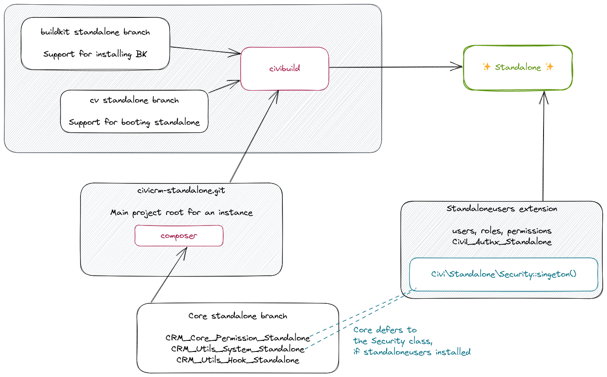

# CiviCRM (Standalone)

This is the development repository for [CiviCRM Standalone](https://lab.civicrm.org/dev/core/-/wikis/standalone). It aims to provide a version of [CiviCRM](https://civicrm.org) that does not require a content management system (CMS), such as WordPress or Drupal.

It is still in the early development stages. Eventually we aim to provide a zip/tar archive that can be uploaded to a web server. Currently it requires [composer](https://getcomposer.org/) or [buildkit (artfulrobot fork)](https://github.com/artfulrobot/civicrm-buildkit/), which are fairly technical tools used mostly by (respectively) PHP and CiviCRM developers.

## Development

We are using CiviCRM's Gitlab for issues/discussion, and Github pull-requests for tracking code changes.

* CiviCRM Standalone meta-issue: https://lab.civicrm.org/dev/core/-/issues/2998
* CiviCRM Standalone github repo: https://github.com/civicrm/civicrm-standalone

We also have a [CiviCRM Standalone channel](https://chat.civicrm.org/civicrm/channels/standalone) on CiviCRM's chat.

## ⚠ Active development forks

Getting install working properly and consistently requires code from no fewer than four repositories to work together! These are:

1. This repo
2. Buildkit
3. CiviCRM Core
4. cv

Development is very much work-in-progress and trying to get PRs merged into 4 projects at each step is tedious. @artfulrobot (Rich) has been doing a lot of work on this recently, and has developed a set of forks of these four repos that all work together. They do not want to *gatekeep* this work, but anyone wanting to work on this will need themselves to fork 4 repos and maintaining all those separate sets of 4 forks is a nightmare; if you want to be able to push to @artfulrobot forks, please ask. **Also, if anyone cleverer than me (Rich) knows a better way to do this, please get in touch!**

The install methods below assume using the artfulrobot forks, and I've tagged everything with this name explicitly to be clear.



## Project layout

- This repo as top dir of project
   - `data/` holds non-web-accessible files including ConfigAndLog, Smarty 
     templates and settings files.
   - `web/` holds web-accessible files:
      - `index.php` This is the main router/request handler.
      - `upload/` holds all the other gubbins, including the `ext/` dir for 
         extensions.
   - `vendor/civicrm/` holds all the composer-sourced code, notably including:
      - `civicrm-core` The core files


## Install with buildkit

Using [artfulrobot's CiviCRM buildkit](https://github.com/artfulrobot/civicrm-buildkit/):

```
# Clone this fork/branch:
git clone git@github.com:artfulrobot/civicrm-buildkit.git -b artfulrobot-standalone

# Swap out the cv for artfulrobot fork:
cd civicrm-buildkit
./use-artfulrobot-cv 

# If everything else is in place you can now use civibuild:
civibuild create mytest1 --type standalone-clean
```

Note that this will always install the latest master/main branch (technically, the artfulrobot fork of master)

## Install with composer

If you don't want the buildkit environment and you want to test the web-based installer, you can do it this way. It assumes you have setup your own httpd/php/sql services and configured them.

Clone this repo as the root of your project and pull in dependencies:

```
cd /var/www/
git clone https://github.com/artfulrobot/civicrm-standalone standalone
cd standalone
composer install
```

Unless your php worker runs as your own user, you may need to configure permissions (adjust for your set-up). e.g.

```
PHPWORKERUSER=www-data
mkdir -m2770 -p web/upload data
chmod g+rwX -R web/upload data
chgrp $PHPWORKERUSER web/upload data
```

Now we need to create some SQL and the database:

```
# The brackets here save you a cd - command after!
( cd vendor/civicrm/civicrm-core/xml && php GenCode.php 0 0 Standalone; )

# create the database - you may need to add your credentials if not stored in ~/.my.cnf
mysql -e "CREATE DATABASE standalone_civicrm;"
```

Now visit the site in your browser. You should get the installer page, but with lots of red notices about database stuff. That's ok, it's just because it doesn't know the DSN for the database. Edit the DSN yourself at the bottom of the page and hit Apply.

At the end you should be able to access /civicrm

## About CiviCRM

CiviCRM is web-based, open source, Constituent Relationship Management (CRM) software geared toward meeting the needs of non-profit and other civic-sector organizations.

As a non profit committed to the public good itself, CiviCRM understands that forging and growing strong relationships with constituents is about more than collecting and tracking constituent data - it is about sustaining relationships with supporters over time.

To this end, CiviCRM has created a robust web-based, open source, highly customizable, CRM to meet organizations’ highest expectations right out-of-the box. Each new release of this open source software reflects the very real needs of its users as enhancements are continually given back to the community.

With CiviCRM's robust feature set, organizations can further their mission through contact management, fundraising, event management, member management, mass e-mail marketing, peer-to-peer campaigns, case management, and much more.

CiviCRM is localized in over 20 languages including: Chinese (Taiwan, China), Dutch, English (Australia, Canada, U.S., UK), French (France, Canada), German, Italian, Japanese, Russian, and Swedish.

For more information, visit the [CiviCRM website](https://civicrm.org).
